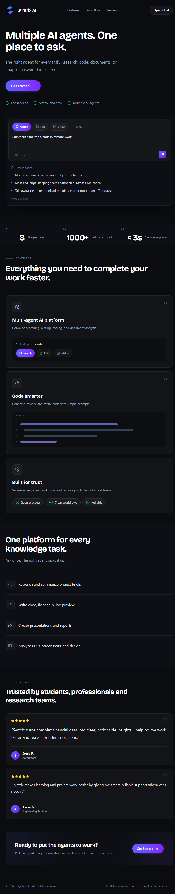
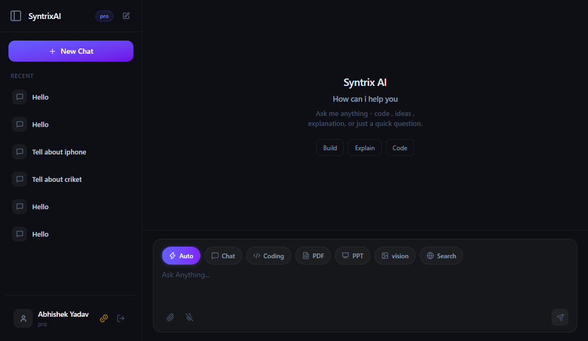
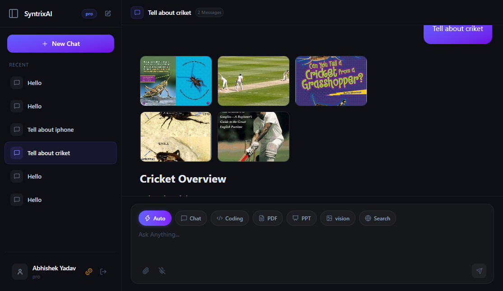
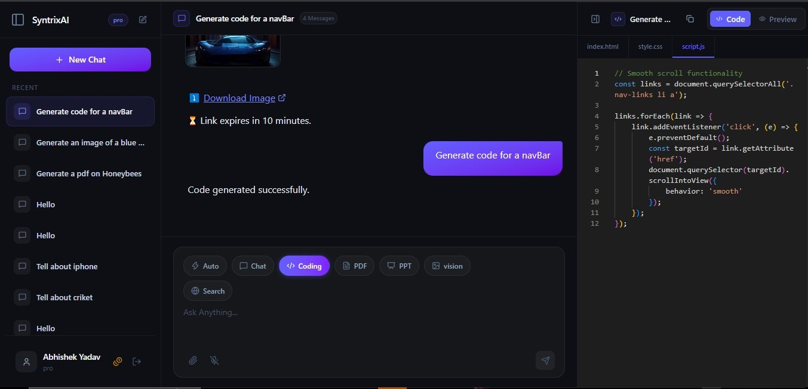
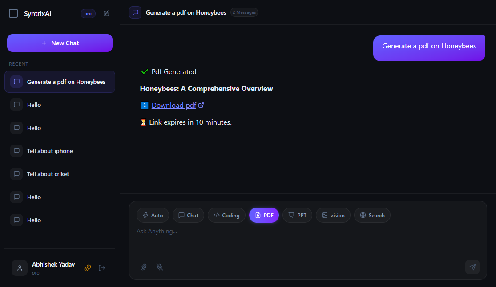
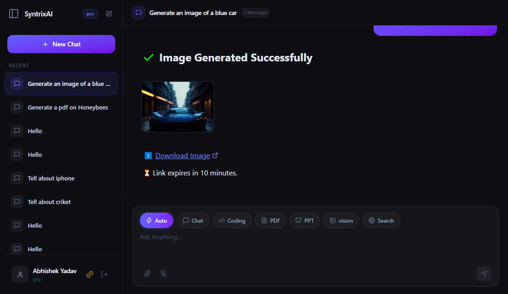
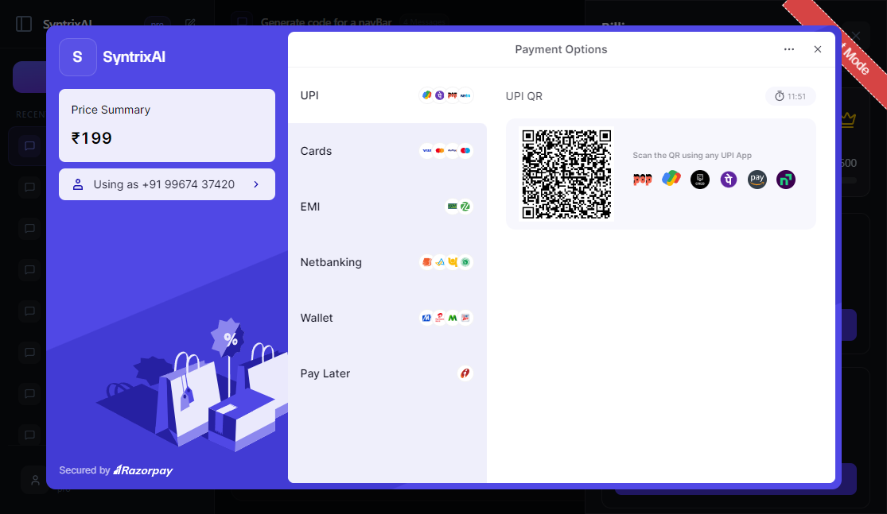

# Syntrix AI

Syntrix is a modern AI platform  designed to help users research, code, analyze documents, work with images  from a single chat .

## Overview

The platform is built around multiple specialized AI agents that can work with:

- Search and research queries
- Code generation and code assistance
- PDF analysis and summary extraction
- Image and vision-based understanding
- PPT/report generation
- Subscription-based access via Razorpay

Syntrix is designed for a smooth full-stack flow: users log in, chat with an AI agent, save conversation context, and optionally generate artifacts such as PDFs, presentations, or analysis outputs.

## Key Features

- Multi-agent AI experience in one interface
- Google login support using Firebase authentication
- Secure API gateway with protected routes
- Persistent chat and conversation history
- PDF, image, and document processing support
- Code generation and coding workflow assistance
- AI-generated presentation and report artifacts
- Razorpay billing and plan management
- MongoDB + Redis + cloud storage integration

## Screenshots

### Landing page

### Chat workspace

### Search agent

### Coding agent

### PDF agent

### Image agent

### Razorpay billing flow

## Tech Stack

### Frontend
- React
- Vite
- Redux Toolkit
- Tailwind CSS
- Firebase for login
- Axios for API calls

### Backend
- Node.js
- Express
- MongoDB via Mongoose
- Redis
- AWS S3 for file uploads/artifacts
- Razorpay for payments
- AI agent services with LangChain and model integrations

##  Use Cases

- Research and summarize information from prompts and web-style context
- Ask coding questions and generate code snippets
- Upload PDFs and extract key insights
- Analyze images or screenshots with AI vision
- Create presentation-ready outputs and reports
- Manage premium access and subscriptions with billing integration

